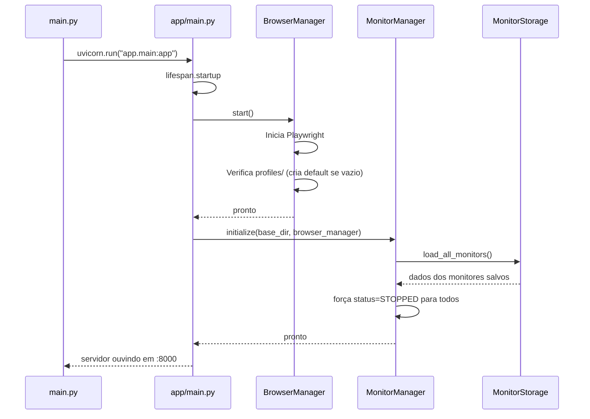
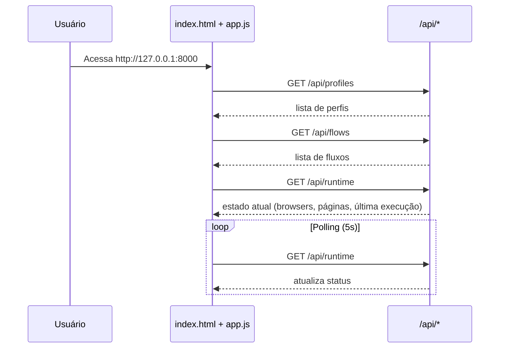
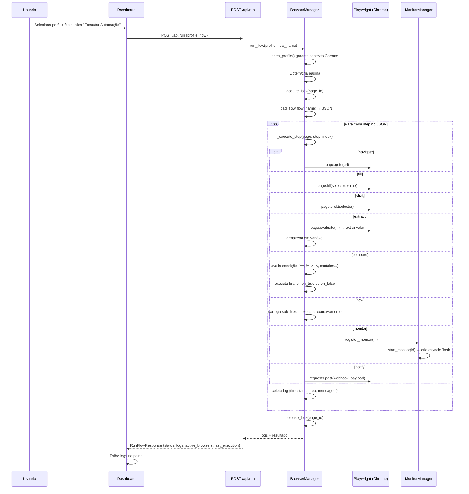
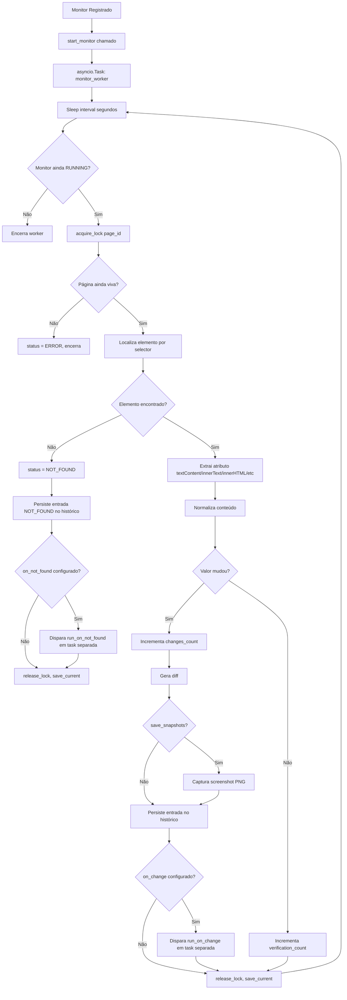
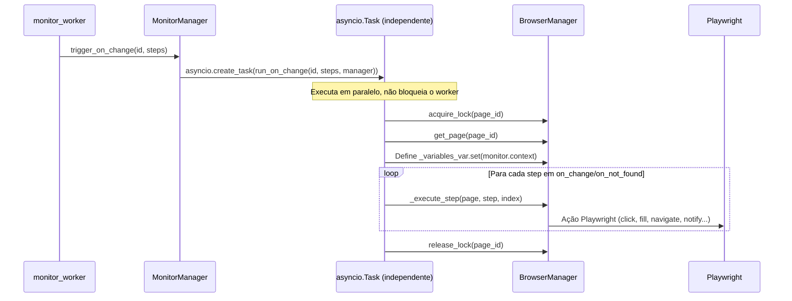
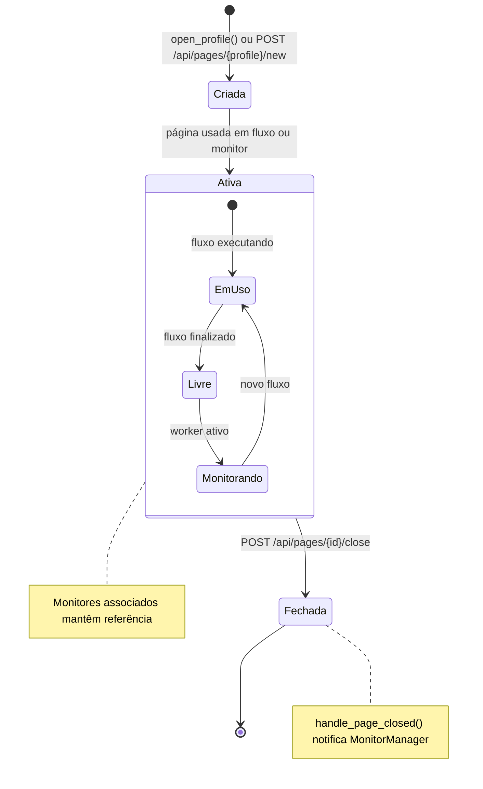
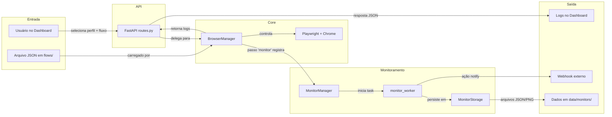
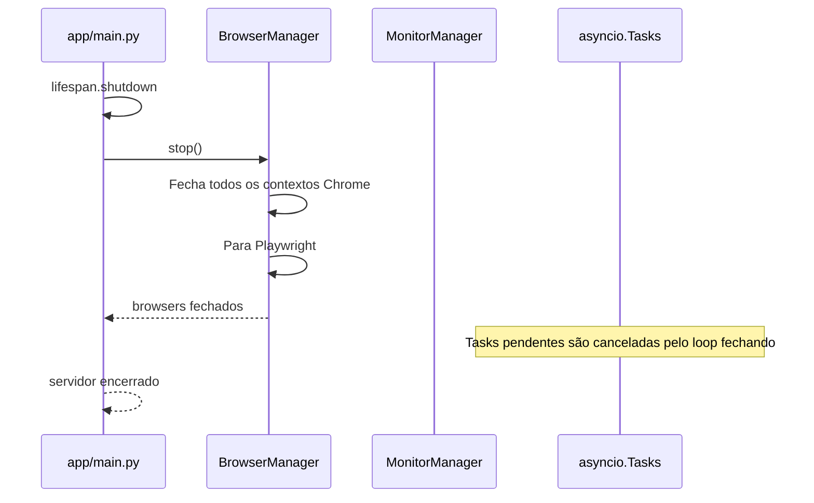

# Fluxo da Aplicação

Fluxo completo desde a entrada do usuário até a execução final, documentado com diagramas Mermaid.

---

## 1. Inicialização do Sistema



---

## 2. Dashboard (Frontend)



---

## 3. Execução de Fluxo (Run Flow)



---

## 4. Monitoramento Contínuo (Monitor Worker)



---

## 5. Fluxo Reativo (on_change / on_not_found)



---

## 6. Ciclo de Vida de Páginas



---

## 7. Fluxo Completo — Visão Macro



---

## 8. Resolução de Variáveis

```mermaid
flowchart TD
    A[Step contém value: '...{VAR}...'] --> B[_resolve_variables]
    B --> C{Texto contém placeholders?}
    C -- Não --> D[Retorna texto original]
    C -- Sim --> E[SafeDict com _variables]
    E --> F[str.format_map SafeDict]
    F --> G{Placeholder existe em _variables?}
    G -- Sim --> H[Substitui pelo valor]
    G -- Não --> I[Mantém placeholder literal]
    H --> J[Texto resolvido]
    I --> J

    subgraph Fontes de _variables
        K[.env (dotenv)]
        L[Passo 'extract' anterior]
        M[Passo 'set']
        N[Monitor.context]
        O[Loop: _loop_iteration, _loop_total]
    end

    K --> E
    L --> E
    M --> E
    N --> E
    O --> E
```

---

## 9. Shutdown



---

## Resumo de Ações de Fluxo

| Ação | Entrada | Saída | Side Effects |
|---|---|---|---|
| `navigate` | url | log | Muda URL da página |
| `fill` | selector, value | log | Preenche campo |
| `click` | selector | log | Dispara evento click |
| `type` | selector, value | log | Digita caractere por caractere |
| `press` | key | log | Pressiona tecla |
| `wait_for_selector` | selector, timeout | log, var (opcional) | Aguarda elemento |
| `wait` | seconds | log | Aguarda N segundos |
| `wait_for_url` | url | log | Aguarda URL |
| `screenshot` | (none) | log | Salva screenshot |
| `scroll` | pixels | log | Rola página |
| `extract` | selector, attr, var | log, _variables atualizado | Popula variável |
| `select` | selector, value | log | Seleciona opção |
| `hover` | selector | log | Hover |
| `log` | message | log | Registra mensagem |
| `loop` | times, interval, steps | log | Itera sub-passos |
| `set` | var, value | log, _variables atualizado | Define variável |
| `compare` | var, operator, value, on_true, on_false | log, execução condicional | Branching |
| `notify` | webhook, payload | log | POST HTTP externo |
| `flow` | flow (nome JSON) | logs do sub-fluxo | Execução aninhada |
| `monitor` | name, selector, interval, on_change, on_not_found | log | Registra monitor + cria worker |
| `change_page` | page_id | log | Troca página ativa |